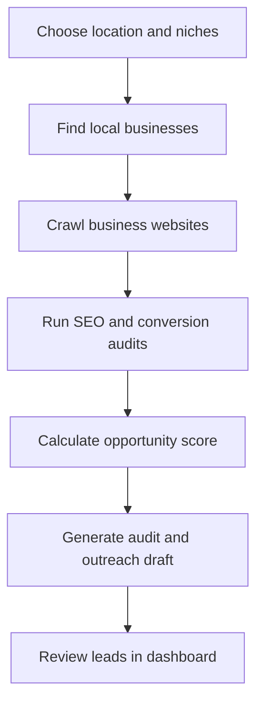

Yes. The best version is a Python lead-generation bot that discovers local businesses, audits their websites, estimates how much SEO opportunity exists, and produces personalized sales leads.

For your project, I would make the location configurable but initially test it on New Bern, since we already identified businesses and audit criteria there.



## 1. Find businesses

Use the official Google Places API instead of scraping the Google Maps interface.

Your bot can run searches such as:

* Electricians in New Bern, NC
* Roofers in New Bern, NC
* Pressure washing in New Bern, NC
* Landscaping companies in New Bern, NC
* Hair salons in New Bern, NC

Google Places Text Search supports location-based text queries, while Nearby Search can find defined business categories inside a geographic radius. Request only necessary fields to control API costs. [Google Places Text Search](https://developers.google.com/maps/documentation/places/web-service/text-search), [Nearby Search](https://developers.google.com/maps/documentation/places/web-service/nearby-search)

Collect:

```json
{
  "name": "Example Electric",
  "website": "https://example.com",
  "address": "New Bern, NC",
  "phone": "...",
  "rating": 4.6,
  "review_count": 38,
  "business_type": "electrician"
}
```

Businesses without websites can be placed in a separate website-development lead list.

## 2. Crawl each website

Use:

* `httpx` for downloading pages
* `BeautifulSoup` or `selectolax` for parsing HTML
* `Playwright` for JavaScript-heavy sites
* `urllib.robotparser` for respecting crawling rules

Limit the crawl to approximately 20 pages per site:

* Homepage
* Service pages
* About page
* Contact page
* Location pages
* Blog or project pages

The crawler should use a clear user agent, respect `robots.txt`, limit request frequency, and avoid crawling private or irrelevant URLs.

## 3. Measure SEO problems

### Technical SEO

Check for:

* HTTPS errors
* Broken pages and links
* Redirect chains
* Missing sitemap
* Accidental `noindex`
* Missing canonical URLs
* Missing or duplicate titles
* Missing meta descriptions
* Multiple or missing H1 headings
* Missing image alt text
* Missing `LocalBusiness` structured data
* Poor mobile performance
* Slow loading
* Large unoptimized images

Google's PageSpeed Insights API provides automated performance, accessibility, and SEO suggestions. Lighthouse can also be run through its command line or Node module. [PageSpeed Insights API](https://developers.google.com/speed/docs/insights/v5/get-started), [Lighthouse documentation](https://developers.google.com/web/tools/lighthouse/)

Google also documents how `robots.txt`, robots meta tags, and sitemaps affect crawling and indexing. [Robots documentation](https://developers.google.com/search/docs/crawling-indexing/robots/intro), [Sitemap documentation](https://developers.google.com/search/docs/crawling-indexing/sitemaps/overview)

### Local SEO

Check whether the website:

* Mentions the target city in its title, H1, and important content
* Displays a consistent business name, address, and phone number
* Has a separate page for each important service
* Has useful pages for surrounding cities
* Uses appropriate local structured data
* Includes locally relevant testimonials and projects
* Has directions, service areas, hours, and contact information
* Connects clearly to its Google Business Profile

### Conversion quality

Also identify:

* No visible call or booking button
* Phone number not clickable on mobile
* Contact form hard to find
* Weak calls to action
* No testimonials or project gallery
* Outdated design
* Generic stock images
* Booking or quote friction

This is valuable because you can sell improvements tied to leads, not merely technical SEO scores.

## 4. Create an opportunity score

Score every category from 0 to 100, where a higher final score means a better sales opportunity:

```python
opportunity_score = (
    technical_gap * 0.25
    + local_seo_gap * 0.25
    + content_gap * 0.20
    + conversion_gap * 0.15
    + visibility_gap * 0.10
    + commercial_value * 0.05
)
```

Example:

| Business            | Opportunity | Main problems                                       |
| ------------------- | ----------: | --------------------------------------------------- |
| Example Electric    |          88 | No service pages, slow mobile site, weak quote path |
| Example Landscaping |          76 | Missing city pages, duplicate titles, no schema     |
| Example Salon       |          39 | Strong site with only minor improvements            |

A company with an awful site but no reviews, no apparent activity, and little commercial value may not be a better lead than an established company with a mediocre website. The score should consider both need and ability to buy.

## 5. Use AI only after collecting evidence

The LLM should not invent the audit. Deterministic code should first collect specific evidence, such as:

```json
{
  "mobile_performance": 38,
  "missing_meta_descriptions": 7,
  "service_pages_found": 1,
  "local_business_schema": false,
  "city_in_homepage_title": false,
  "phone_clickable": false
}
```

Then give that evidence to the model and ask it to generate:

* A concise audit summary
* The three highest-impact improvements
* A personalized email
* A suggested service package
* Talking points for a sales call

Example output:

> Your site currently groups electrical services on one page and does not have dedicated pages for panel upgrades, EV chargers, or emergency service. Creating those pages would give Google clearer pages to rank for those New Bern searches.

Keep outreach human-approved initially. Automated mass email creates deliverability and spam-compliance problems.

## 6. Recommended stack

For you, I would use:

* Python and FastAPI
* PostgreSQL
* Redis with Celery or RQ
* `httpx`
* `selectolax`
* Playwright
* PageSpeed Insights API
* Google Places API
* OpenAI API for summaries and outreach
* React with shadcn for the dashboard

Core tables:

```text
businesses
websites
crawl_pages
audit_runs
audit_findings
keyword_checks
lead_scores
outreach_drafts
lead_status
```

## 7. Build the MVP in this order

1. Search one city and five niches.
2. Save businesses and remove duplicates.
3. Crawl the homepage plus important internal pages.
4. Implement 15 reliable audit checks.
5. Calculate an opportunity score.
6. Generate a one-page audit.
7. Export the best leads to CSV.
8. Add a dashboard only after the scoring produces useful leads.

The first target should be around 200 New Bern businesses across home services, salons, dental practices, and other appointment or quote-driven industries. Manually inspect the top 25 results and adjust the scoring until at least 15 are genuinely good prospects.

The important product is not “an AI SEO auditor.” It is a system that gives you a prioritized daily list like: “These five local businesses have a real SEO problem, can probably afford help, and here is the evidence and personalized pitch.”

## Current script

The first working version is implemented as `seo_opportunity_finder.py`. It respects
`robots.txt`, checks up to 20 pages per website, runs deterministic SEO and conversion
checks, calculates the weighted opportunity score, and exports ranked leads.

Requires Python 3.9 or newer. Set it up with:

```bash
python -m venv .venv
source .venv/bin/activate
pip install -e '.[dev]'
```

Audit one website and print its evidence as JSON:

```bash
python seo_opportunity_finder.py audit https://example.com \
  --city "New Bern" \
  --name "Example Electric" \
  --rating 4.6 \
  --reviews 38
```

Audit a list of businesses and create a ranked CSV:

```bash
python seo_opportunity_finder.py audit-file examples/businesses.json \
  --city "New Bern" \
  --output data/leads.csv
```

Businesses without a website are automatically written to a separate
`leads-no-website.csv` file. The example data is illustrative; replace it with real,
permissioned Google Places results before using the output for prospecting.

### Discover businesses with Google Places

Add a restricted Places API (New) key to `.env`:

```dotenv
GOOGLE_PLACES_API_KEY=your_key_here
```

Discover businesses across one or more niches:

```bash
python seo_opportunity_finder.py discover \
  --city "New Bern, NC" \
  --niches "hair salons" "electricians" "roofing contractors" \
  --output data/businesses.json
```

The command requests 20 results per niche by default and removes duplicates using the
Google Place ID. It includes businesses with a rating of at least 3.5 and at least five
reviews. Qualified businesses with independently controlled websites are written to
`data/businesses.json`. Qualified businesses with no site—or only a social, directory,
marketplace, or third-party booking profile—are written to
`data/businesses_no_website.json`. Their original profile URL is retained as
`external_profile_url`. Override the thresholds with `--min-rating` and
`--min-reviews` when needed.

Use `--pages-per-niche 2` or `3` to request more results, at additional API cost. Google
currently caps Text Search at 60 results across all pages for one query.

With a custom output such as `data/new-bern-businesses.json`, no-website leads go to
`data/new-bern-businesses_no_website.json`. Override that path when needed:

```bash
python seo_opportunity_finder.py discover \
  --city "New Bern, NC" \
  --niches "hair salons" \
  --output data/businesses.json \
  --no-website-output data/businesses_no_website.json
```

Audit the discovered websites:

```bash
python seo_opportunity_finder.py audit-file data/businesses.json \
  --city "New Bern" \
  --output data/leads.csv
```
